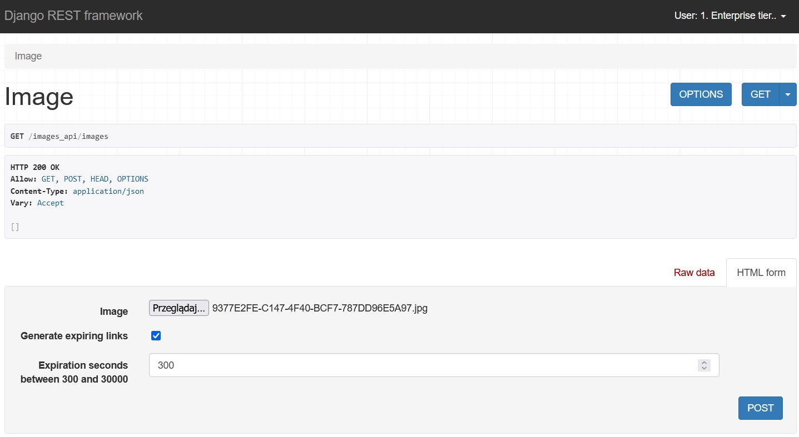
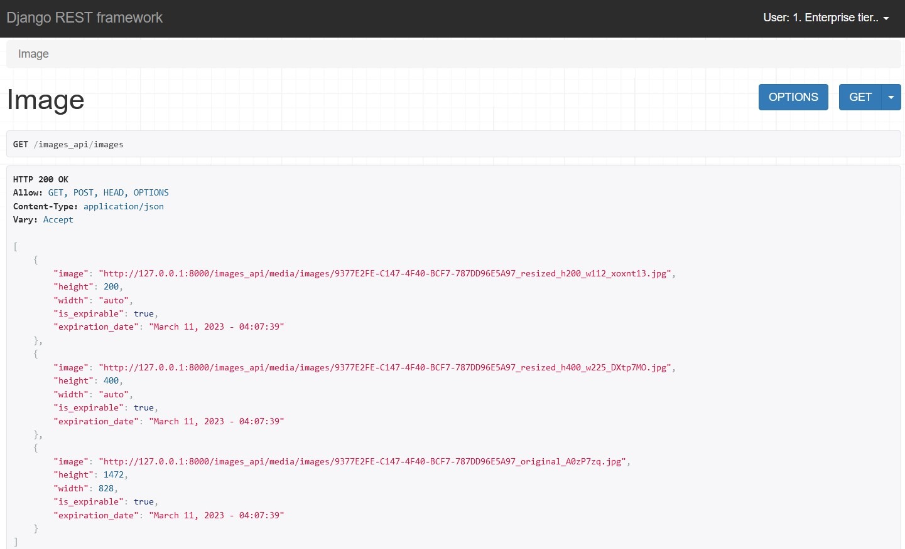

# HEXOCEAN
## Recruitment task for Backend (Python + Django) Engineer position
### Cezary Suwiński - 12 March 2023

&nbsp; 

**Completion time: ca. 12-16H with educating**

**Demo video: coming soon**

&nbsp; 

**How to run the project**
1. Go to your terminal window, go to the desired directory and run ```git clone https://github.com/Ma-xwell/DRF-API-images.git hexocean``` in your terminal
2. In your terminal run ```cd hexocean```, ```code .env``` and in the *.env* file type ```SECRET_KEY = 'XXX'``` where *XXX* is your secret key. Save the file.
3. Run ```docker compose up``` in your terminal while being in the root directory (top *hexocean* directory). This might take a while.
4. You can click CTRL+C and run ```python manage.py createsuperuser``` in your terminal and follow the instructions
5. Again, run ```docker compose up```, click on the link prompted in the terminal and navigate to */admin/* route on the website after opening it
6. Log In using credentials you have provided in step **3.**
7. Now you can create new Users. After creating any, click on them and assign them to any tier (there are three built-in tiers: Basic, Premium, Enterprise)
8. Each tier can be modified, as well as new ones can be created. As an admin, you can specify if newly created tier should have expirable links available, presence of the link to the originally uploaded file but also you can set arbitrary thumbnail sizes. When setting arbitrary thumbnail sizes, height should be always provided. Width is optional - if you will set width to 0 *(zero)*, it will be automatically calculated based on height without losing image's ratio. However, you can set width to any positive integer you want.
*remember: newly created user has not tier allocated by default. Do it, otherwise user will not be able to upload any images to the page!*
9. As a logged user, navigate to */images_api/images/* and upload your first image.
10. After successful upload, click on **Image** at the top of the DRF UI, this will show you GET request, listing all the images that currently logged user has uploaded along with their attributes such as height, width, information if image is expirable and if it is, the date and time of expiration.


## Quick look at the DRF UI

**POST request** - uploading new image with expiring link set for 300 seconds (5 minutes)

&nbsp; 



&nbsp; 

**GET request** - listing all the user's images with their attributes

&nbsp; 

